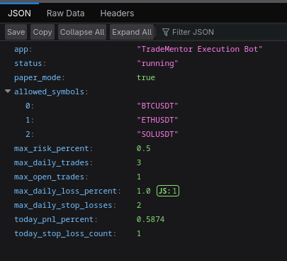
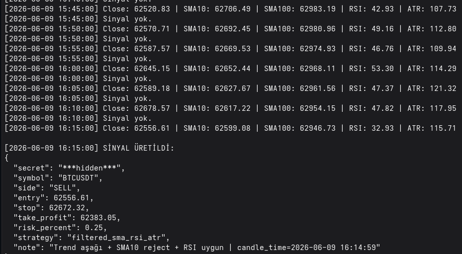
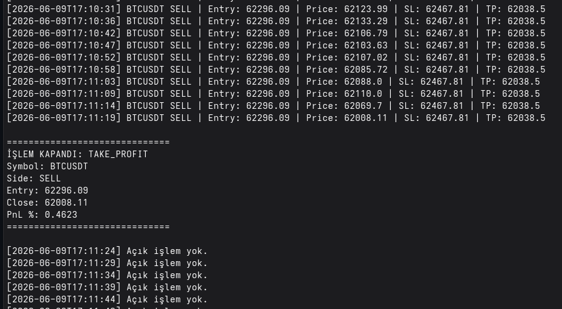
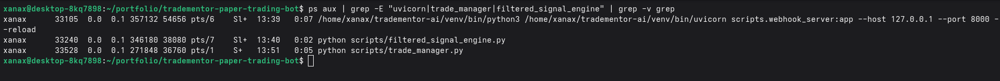
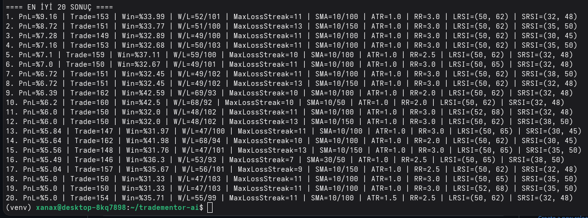
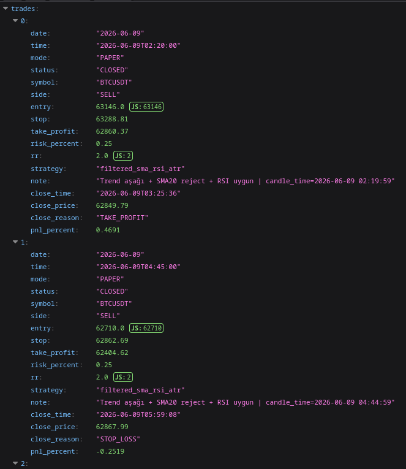

# TradeMentor Paper Trading Bot

A Linux-based automated paper trading system built with **Python**, **FastAPI**, **Binance market data**, webhook-based signal processing, risk management, trade tracking, backtesting and strategy optimization.

> This project does **not** execute real trades. It is designed for paper testing, automation learning, risk-management experiments and DevOps-style system building.

---

## Why I Built This

The goal of this project was to build a real-world automation system that combines:

- live market data processing,
- API/webhook communication,
- risk validation,
- background process management,
- JSON-based logging,
- strategy backtesting,
- parameter optimization,
- Linux-based service workflow.

Instead of only following tutorials, I wanted to build a working system end-to-end and document how the components communicate with each other.

---

## System Architecture

~~~text
Binance WebSocket Market Data
        |
        v
Filtered Signal Engine
        |
        v
FastAPI Webhook Server
        |
        v
Risk Management Layer
        |
        v
Paper Trade Log
        |
        v
Trade Manager
        |
        v
TP / SL Close Tracking
~~~

---

## Main Components

### 1. Webhook Server

`webhook_server.py`

A FastAPI service that receives trade signals, validates them and logs accepted paper trades.

It checks:

- webhook secret,
- allowed symbols,
- trade direction,
- entry / stop / take-profit values,
- max risk per trade,
- max daily trades,
- max open trades,
- max daily loss,
- max daily stop-loss count,
- risk/reward ratio.

---

### 2. Filtered Signal Engine

`filtered_signal_engine.py`

A market-data engine that listens to Binance candlestick data and generates paper trade signals using configurable filters.

Current filters include:

- SMA fast / slow trend filter,
- RSI range filter,
- ATR-based stop-loss,
- configurable risk/reward target,
- cooldown after signals.

---

### 3. Trade Manager

`trade_manager.py`

Tracks open paper trades and closes them when price reaches:

- stop-loss,
- take-profit.

It updates the trade log with:

- close time,
- close price,
- close reason,
- PnL percentage.

---

### 4. Report Script

`report.py`

Generates a quick performance summary:

- total trades,
- closed trades,
- open trades,
- winning trades,
- losing trades,
- win rate,
- total paper PnL,
- latest trade results.

---

### 5. Backtesting

`backtest_filtered.py`

Runs the strategy on historical Binance candlestick data and estimates past performance.

---

### 6. Optimizer

`optimizer.py`

Tests multiple parameter combinations and ranks strategy configurations based on:

- estimated PnL,
- win rate,
- trade count,
- max losing streak,
- risk/reward setup.

---

## Tech Stack

- Fedora Linux
- Python
- FastAPI
- Uvicorn
- Binance REST API
- Binance WebSocket stream
- JSONL logging
- dotenv configuration
- CLI-based process workflow
- Git / GitHub

---

## Quick Start

> This project is designed for local paper-trading and educational system-design purposes only.  
> It does not execute real trades and does not provide financial advice.

### 1. Clone the repository

~~~bash
git clone https://github.com/cagrimertcnn/tradementor-paper-trading-bot.git
cd tradementor-paper-trading-bot
~~~

### 2. Create and activate a Python virtual environment

~~~bash
python3 -m venv venv
source venv/bin/activate
~~~

### 3. Install dependencies

~~~bash
pip install -r requirements.txt
~~~

### 4. Create local environment configuration

~~~bash
cp .env.example .env
~~~

Edit `.env` and set your local configuration values.

### 5. Start the FastAPI webhook server

~~~bash
uvicorn scripts.webhook_server:app --host 127.0.0.1 --port 8000 --reload
~~~

Health/status endpoint:

~~~bash
curl http://127.0.0.1:8000/
~~~

Paper trade logs endpoint:

~~~bash
curl http://127.0.0.1:8000/trades
~~~

### 6. Start the filtered signal engine

Open a second terminal:

~~~bash
source venv/bin/activate
python scripts/filtered_signal_engine.py
~~~

### 7. Start the trade manager

Open a third terminal:

~~~bash
source venv/bin/activate
python scripts/trade_manager.py
~~~

The system should now run with three local processes:

~~~text
FastAPI webhook server
Filtered signal engine
Trade manager
~~~

### 8. Run backtesting and optimization

Backtest:

~~~bash
python scripts/backtest_filtered.py
~~~

Optimizer:

~~~bash
python scripts/optimizer.py
~~~

---

## Example Runtime Processes

The system is designed to run as three separate processes:

~~~bash
uvicorn scripts.webhook_server:app --host 127.0.0.1 --port 8000 --reload
python scripts/filtered_signal_engine.py
python scripts/trade_manager.py
~~~

---

## Example Risk Settings

~~~env
PAPER_MODE=true
MAX_RISK_PERCENT=0.5
MAX_DAILY_TRADES=3
MAX_OPEN_TRADES=1
MAX_DAILY_LOSS_PERCENT=1.0
MAX_DAILY_STOP_LOSSES=2
SIGNAL_RISK_PERCENT=0.25
RR_TARGET=1.5
~~~

---

## Screenshots

### FastAPI Status Endpoint

### Filtered Signal Engine

### Trade Manager Closing a Paper Trade

### Active Linux Processes

### Strategy Optimizer Results

### Paper Trade Logs

---

## What This Project Demonstrates

This project was built as a practical portfolio project for Linux, Python automation and DevOps-style system design.

It demonstrates:

- building a local API service with FastAPI,
- working with environment-based configuration,
- separating secrets from source code,
- consuming live market data through WebSocket streams,
- validating incoming trading signals,
- managing paper trades with risk limits,
- logging trade events for later analysis,
- running backtests and parameter optimization,
- documenting architecture and operational behavior,
- using Git and GitHub for version control and project presentation.

The goal is not to claim trading profitability.  
The goal is to show the ability to design, implement, run and document a real automation system on Linux.

---

## Operational Notes

In the current local setup, the application is run manually in separate terminal sessions.

A more production-like deployment could include:

- Dockerizing each component,
- running services with Docker Compose,
- adding structured logging,
- adding monitoring and alerting,
- storing trades in SQLite/PostgreSQL instead of JSONL files,
- adding unit tests for signal validation and risk controls,
- using systemd services or containers for process supervision,
- adding CI checks with GitHub Actions.

---

## Limitations

This is a paper-trading project and should not be used for live trading without additional testing, security hardening and risk review.

Backtesting can overfit historical data.  
Forward paper testing is required before making any real-world decision.

---

## Important Disclaimer

This project is for educational and paper-trading purposes only.

It does not provide financial advice, does not guarantee profit and should not be used for live trading without extensive testing, monitoring and risk controls.
